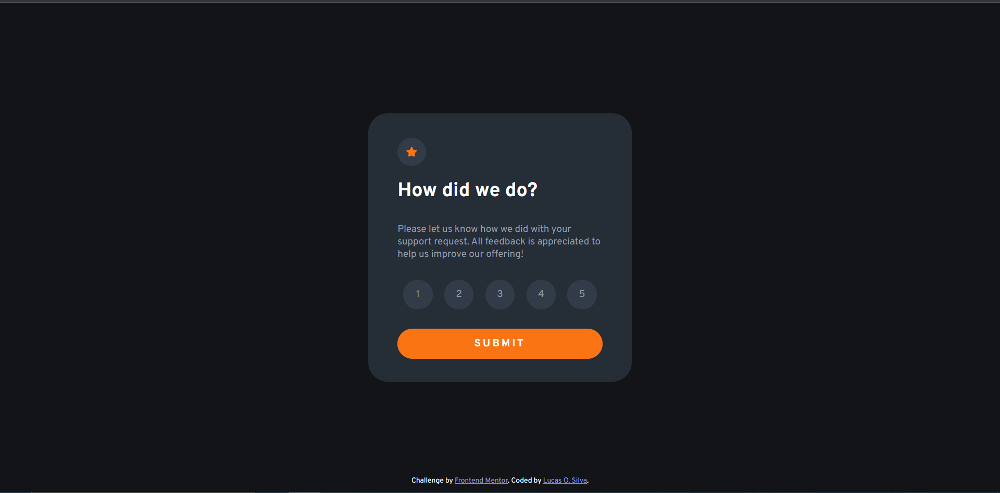
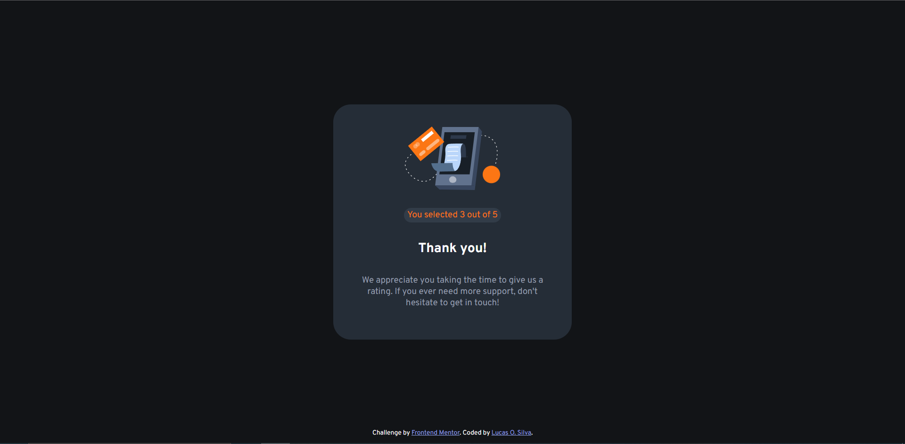

# Frontend Mentor - Interactive rating component solution

This is a solution to the [Interactive rating component challenge on Frontend Mentor](https://www.frontendmentor.io/challenges/interactive-rating-component-koxpeBUmI). Frontend Mentor challenges help you improve your coding skills by building realistic projects. 

## Table of contents

- [Overview](#overview)
  - [The challenge](#the-challenge)
  - [Screenshot](#screenshot)
- [My process](#my-process)
  - [Built with](#built-with)
  - [What I learned](#what-i-learned)
  - [Continued development](#continued-development)
- [Author](#author)


## Overview

  This challenge was more about the JS part then anything givem I'm not confortable with it yet, that said I'm satisfied with how I did it. There's one problem in it (that I know of at least) that I didn't correct, and it is that you are able to submit the score without selecting anything, but I think that for the purposes of this challenge this isn't a big problem.

### The challenge

Users should be able to:

- View the optimal layout for the app depending on their device's screen size
- See hover states for all interactive elements on the page
- Select and submit a number rating
- See the "Thank you" card state after submitting a rating

### Screenshot





## My process

I take the recommended process of starting with the HTML and then going through with the css from top to bottom. I wasn't sure if I wanted to use the li or button tags for the score selection, I opted for the li once I learned that it could have the value attribute, but I actually had a buttons version to use the focus attribute but when I noticed that the focus would go off by clicking any part of the site I decided to do the effect with classes and JS. I didn't have more problems with the HTML and CSS parts. The JS was not difficult but I got stuck trying to figure out how to remove the selected class of other buttons when clicking a new one, once I figured that out the rest was straighfoward. 

At the start of the challenge I wasn't sure if I should build a second page for the 'thank you' or if I should do it the way I did, I still don't know if this was the best approach however I think I was able to meet the rules of the challenge.

### Built with

- Semantic HTML5 markup
- CSS custom properties
- Sass
- Mobile-first workflow

### What I learned

As I said this was the code I had more trouble with, I can't tell if it is the best solution for removing the classes of all buttons but I'm happy I figured out a way on my own by failing and retrying.

```js
scoreButtons.forEach( button => {  
  button.onclick = () => {

   scoreButtons.forEach(button => {
    button.classList.remove('selected')
   })
    
   button.classList.add('selected')
   valor = button.value
  } 
})
```

### Continued development

Js is my main focus righ now, once I get more confortable with it I intend to come back to this project and solve the problem where you're able to submit without chosing a score.

## Author

- Frontend Mentor - [@Lc-Olimpio](https://www.frontendmentor.io/profile/Lc-Olimpio)

